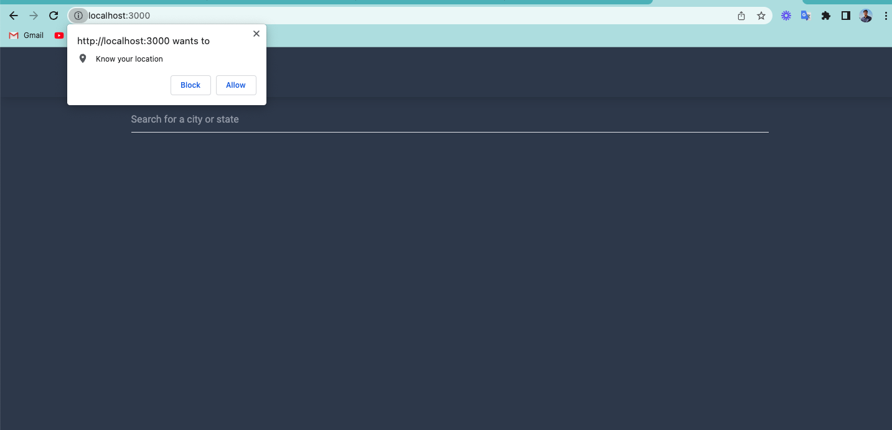

# Weather App Project

Simple Weather App.

<br>
## Project Setup

```sh
yarn install
```

<br>
### Compile and Hot-Reload for Development

```sh
yarn dev
```

<br>
### Compile and Minify for Production

```sh
yarn build
```

<br>

<br/>

<br/>

<br/>

