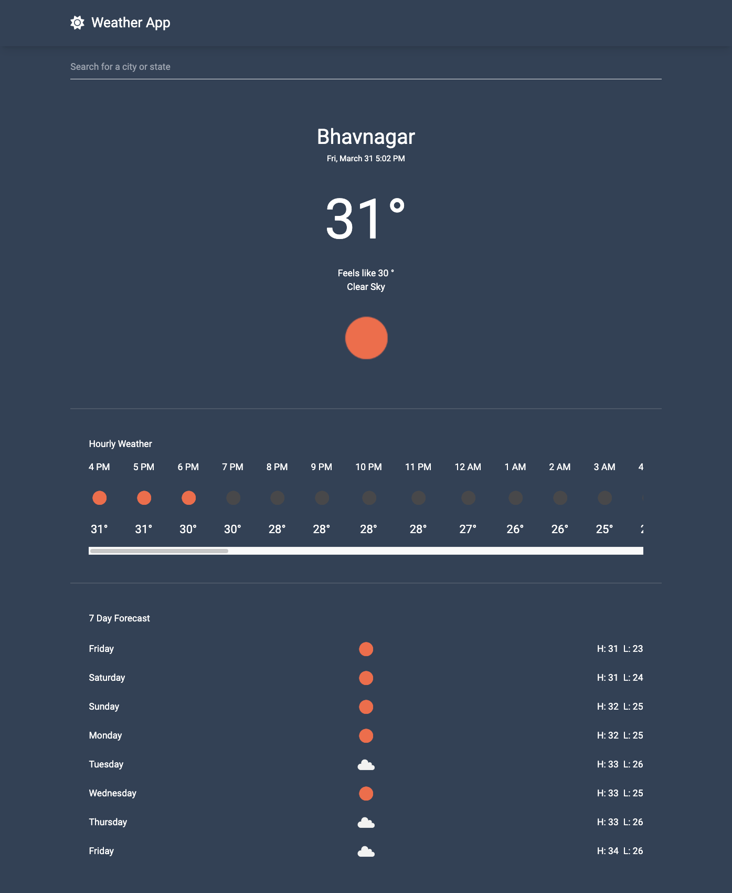
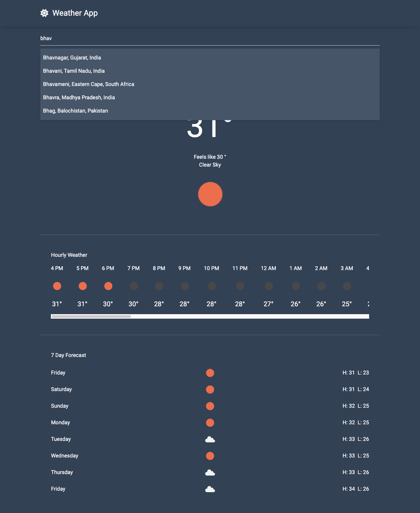
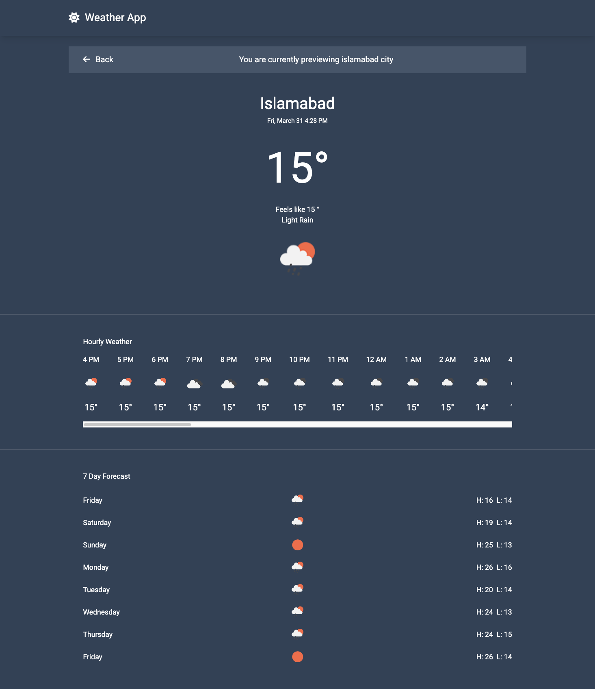

# vue-project

This template should help get you started developing with Vue 3 in Vite.

## Project Setup

```sh
yarn install
```

### Compile and Hot-Reload for Development

```sh
yarn dev
```

### Compile and Minify for Production

```sh
yarn build
```


<br/>

<br/>

